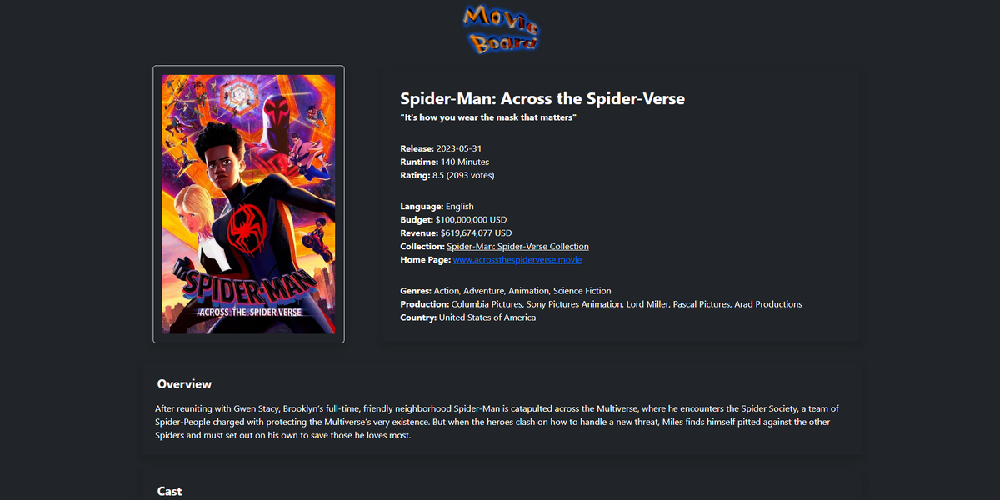
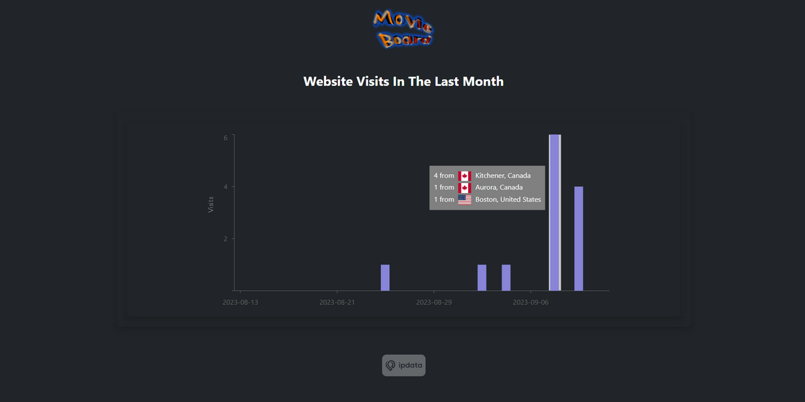

<h1 align="center">Movie Board</h1>

### Deployment

Available at: [movie-board.onrender.com](https://movie-board.onrender.com)

### Overview

A responsive React-based movie website which allows users to view trending movies and TV shows, search for movies, discover similar movies, and see streaming options. It showcases details like rating, genres, overview, videos, cast, reviews, links, collections, and more. Furthermore, it aggregates telemetry data and displays the numbers of visitors in the last month.

## Front-end

### Stack

- React
- Bootstrap
- Material UI
- Framer Motion

### Setup

1. Obtain API tokens:
   - WatchMode for streaming providers.
   - TMDB for all other movie details.
   - ipdata for telemetry data.
2. Download the repository and go to `frontend/movie-board/`.
3. Create a `.env` file with the API tokens (example in .env_example).
4. Run it with the commands below.
5. Go to http://localhost:4173.

### Commands

```bash
npm install
npm run build
npm run preview
```

## Back-end

### Stack

- Node.js
- Express

### Setup

1. Download the repository and go to `backend/`.
2. Create a `.env` file with the MongoDB connection string (example in .env_example).
3. Run it with the commands below.
4. It will start at http://localhost:5000/telemetry.

### Commands

```bash
npm install
npm run devStart
```

## Database

### Stack

- MongoDB

### Setup

1. Create an account on [MongoDB](https://www.mongodb.com/).
2. Create a new database.
3. Create a new user and password.
4. Allow access from your specific IP or any IP (0.0.0.0/0).
5. Adjust the back-end `.env` with the database parameters (example in .env_example).

## References

- All movies, TV, details, etc. API: [TMDB](https://www.themoviedb.org)
- Streaming providers API: [WatchMode](https://www.watchmode.com)
- Telemetry API: [ipdata](https://ipdata.co/)
- Missing movie thumbnail: [Pinterest](https://www.pinterest.ca/pin/movie-icon-aesthetic-black-and-white--208361920250010171)
- Missing cast icon: [Vecteezy](https://www.vecteezy.com/vector-art/8442086-illustration-of-human-icon-vector-user-symbol-icon-modern-design-on-blank-background)

### Screenshots


<hr/>



<hr/>


<hr/>


<hr/>


